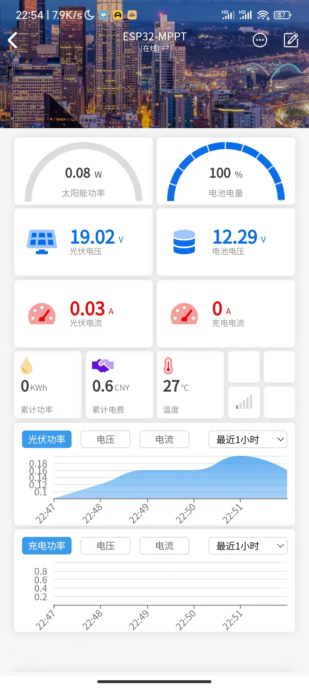

# ESP32 MPPT

#### 介绍
基于esp32-wroom-32的MPPT同步整流充电系统

此项目基于https://www.instructables.com/DIY-1kW-MPPT-Solar-Charge-Controller/

PCB工程修改自Gggggg的立创版本 esp32 mppt - 嘉立创EDA开源硬件平台 https://oshwhub.com/gggggg/esp32-1kw-mppt_copy

本项目对应立创EDA工程文件：https://oshwhub.com/muyan2020/wei-yan-zheng-esp32-guang-fu-pv-mppt-ina226

 **【降压同步整流版本HW5.01】** 

HW5.01的程序使用ARDUINO_MPPT_FIRMWARE_V2.1

本项目修改为2颗INA226方案，输入和输出的电压电流都能监测到

 **高端检测**  电压不要超过36V，否则可能损坏ina226

 **低端检测**  已验证，耐压没问题，不过输入端电流会包含esp32等内部耗电，程序部分需要自行修改 2_Read_Sensors.ino ，将

`CSI_converted = ina1.readShuntCurrent();`

修改为

`CSI_converted = -ina1.readShuntCurrent();`

 **【升压/降压同步整流版本HW6.01】** 

HW6.01的程序使用 https://gitee.com/muyan3000/esp32-mppt/tree/master/esp32_buck_boost/bin/HW6

在降压版本的基础上，升压需要通过更换输入输出，外部开关来进行模式切换

 **为了避免意外发生，请仔细检查接入及切换开关位置！！！** 

 **_使用时将主板上的升降压开关切换至降压模式，在对应的端子上接入输入电源，开机_** 

此版本提供bin直接烧录，省得各种配置劝退

1、按图中打钩项选择，然后按boot+en进入download模式

flash_download_tool工具（下载地址：[https://www.espressif.com/zh-hans/support/download/other-tools](https://www.espressif.com/zh-hans/support/download/other-tools) ），选择esp32进行烧写

建议先烧录https://gitee.com/muyan3000/esp32-mppt/blob/master/esp32_buck_boost/bin/i2cdetect.bin，I2C检测程序，检查INA226的地址是否正确
正常的TI INA226地址为0X40和0X41

2、烧写完成后，通过串口调试助手之类的串口工具，对输入输出电压进行查看校准

查看校准参数 CHKVD

校准输入电压 示例：INVD19.22

用万用表测量实际输入电压，例如为19.22

在串口发送界面输入：INVD19.22

校准输出电压 示例：OUTVD16.22

用万用表测量实际输出电压，例如为16.22

在串口发送界面输入：OUTVD16.22

3、配网及blinker设置

第一次配置，通过设置界面，找到配网菜单，点击配网，会自动开启"ESP32_MPPT"的热点

使用手机wifi或电脑的wifi进行连接

手机端会自动跳转访问设置页，电脑端找一下网关地址，浏览器访问网关地址即可进行设置

如果已经配置过网络，则通过esp32的客户端地址访问

4、脱离串口的OTA固件升级，使用OTA对应的bin升级会保留设置数据，（请仔细检查固件对应的硬件版本进行升级，如果升级失败只能通过串口重新烧录）

OTA必须配网完成才能使用，可以通过浏览器访问 [http://ESP32_MPPT.local](http://) 或访问对应的客户端IP

OTA的账号：admin，密码：ESPmppt

5、深度休眠时间设置，默认为19点至5点间esp32进入超低功耗的深度休眠 20221013

然后就可以愉快地使用了

#### 软件架构
基于ESP32的MPPT充电系统

远程采集使用blinker，界面在程序目录中，复制到blinker的界面配置即可

#### 安装教程
修改ARDUINO_MPPT_FIRMWARE_V2.1.ino文件中的wifi配置信息及blinkerid

Liquid Crystal I2C LCD Library (By: Robojax) 这个库不能用

用LiquidCrystal_I2C By:Frank de Brabander的版本

INA226的库名是：INA226Lib

/*

    INA226 Bi-directional Current/Power Monitor. Simple Example.

    Read more: http://www.jarzebski.pl/arduino/czujniki-i-sensory/cyfrowy-czujnik-pradu-mocy-ina226.html

    GIT: https://github.com/jarzebski/Arduino-INA226

    Web: http://www.jarzebski.pl

    (c) 2014 by Korneliusz Jarzebski

*/

#### 使用说明
各版本looptime比较
INA226版本

ads1015版本

ads1115版本

#### 更新说明
20220706

修改充电算法中predictivePWM() 算法 ，解决压差小于6V时，输出电压大于电池电压的问题

20220902

升/降压版本：

增加WEB配网，同时设置Blinker ID

OTA webupdate

校准输入电压 INVD19.22

校准输出电压 OUTVD16.22

查看校准参数 CHKVD

修正首次烧录数据错乱问题

20220904
new UI

20220924
采用多点采样快速查找最大功率点
修复wifi自动重连逻辑

#### 参与贡献
高冧，熊喵，龙卷风，小一科技

